# Welcome to Confirmator

Confirmator is a faster way to send out the next day confirmation emails for Trilogy Education Tutors.

Link: https://ali-row.github.io/Confirmator/

### Here's how it works:

Once you open up the app you will be presented with a clean and modern user interface.

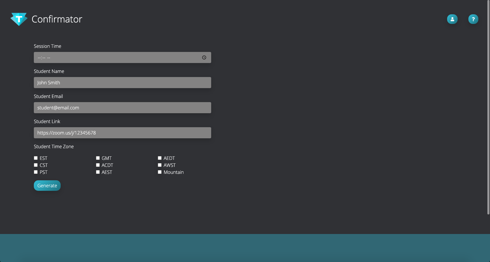

To begin we click on the tutor sign in button on the top right of the page.

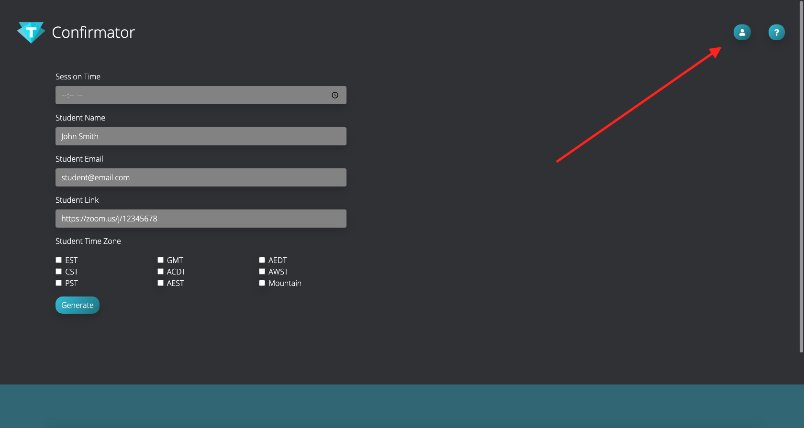

A modal will open up, we fill out our first name then click save, you'll notice your name now appears in place of the default icon, this can be changed at any time.

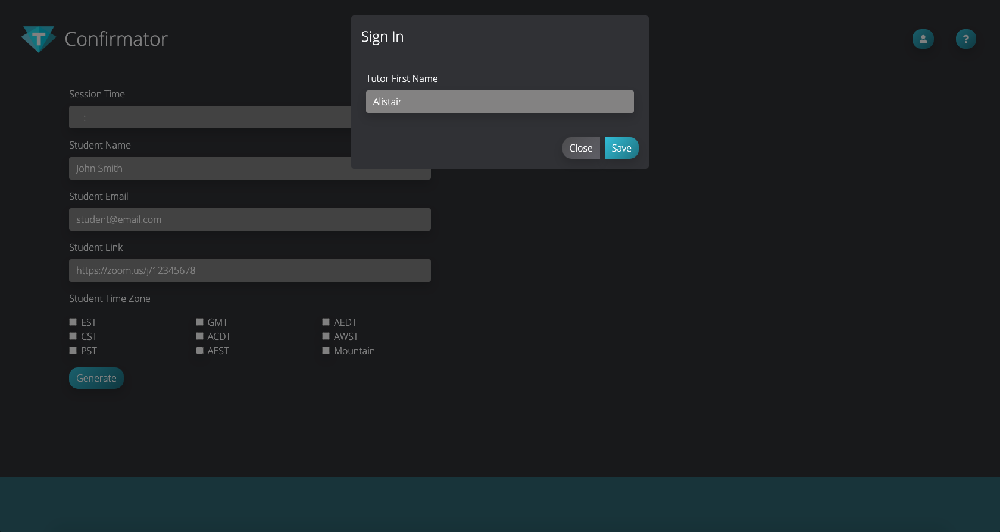

Now we can fill out the fields with all of the necessary information, first the time of the session, then AM or PM, then the students name, email, the zoom link for that particular student and last but not least the students timezone.

Once we click generate you'll notice 2 things will happen, first it renders a preview of the email subject line and body below and secondly it will save the student on the right.

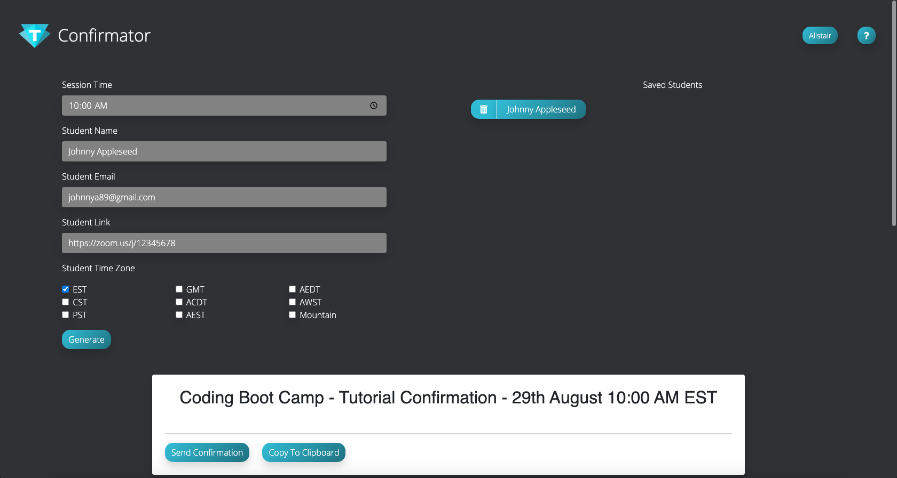

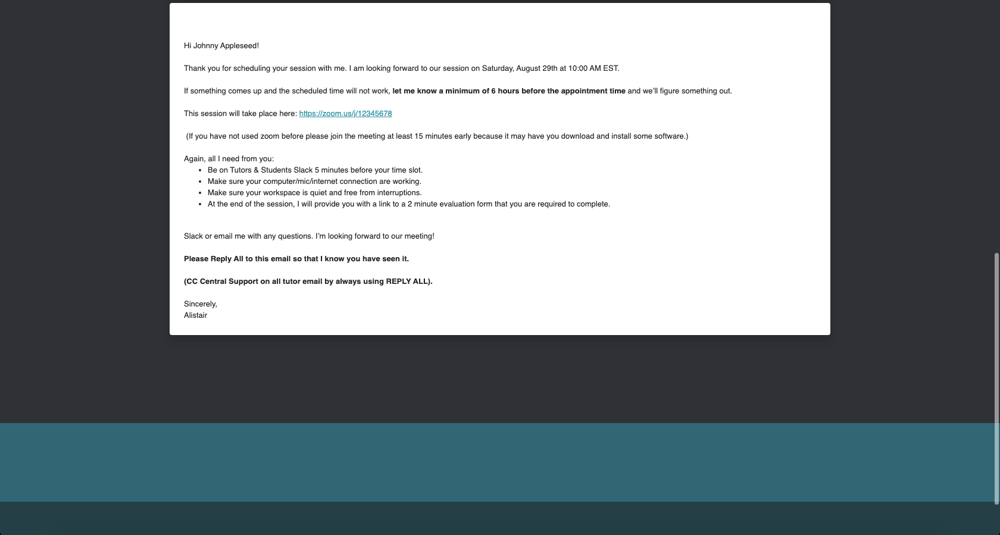

The next thing we can do is click on the 'Copy To Clipboard' button and then click on the 'Send Confirmation' button, this will either open up gmail in the browser or it will open up your built in Mail application on macOS or Windows, you'll notice that MomentJs has already picked the next day for us, which is a nice little time saver.

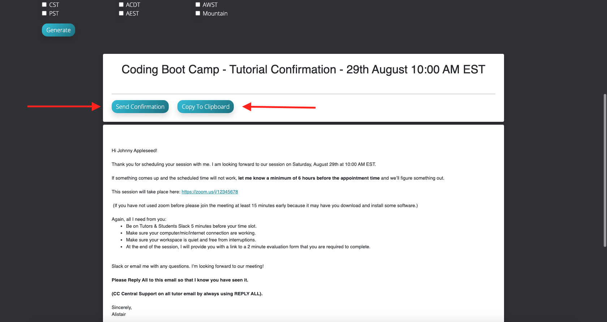

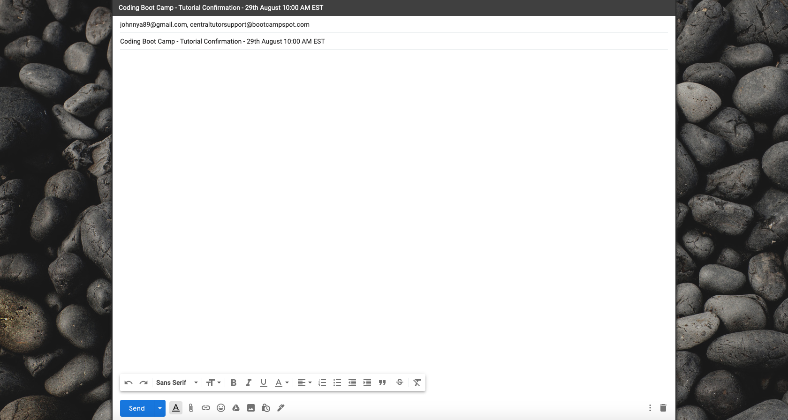

Once on the email page you'll notice that the students email has been auto filled, additionally you'll notice that central support has been added as a CC recipient and that the subject line has been auto filled also.

Inside the body you can hit 'CMD + V' on macOS or 'CTRL + V' on Windows to paste the body of the email we copied earlier, if you'd prefer you can also right click and hit paste, then hit send.

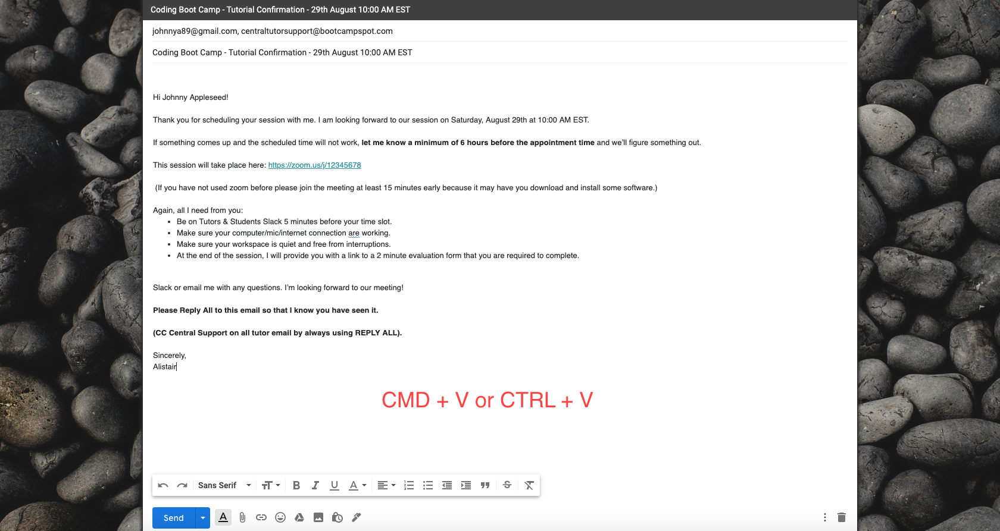

If you got this far then you are good to go ahead and add as many students as you have on your roster, once added you can click them at any time and send the confirmation email with ease.

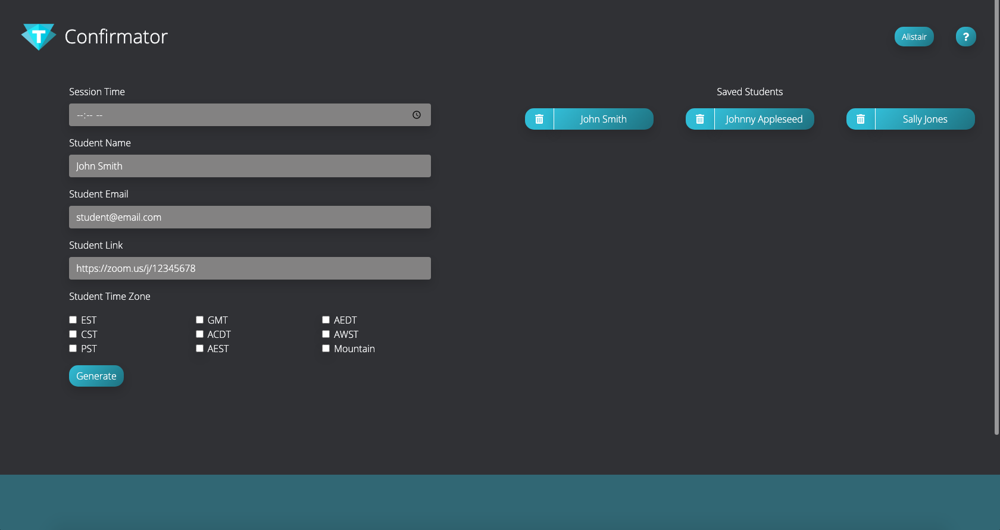

Now what if a student changes their usual time or they book by themselves each week? How do we change the time after it is saved? Simple, we put the new time into the session time input field BEFORE we click the students button, follow steps 1 - 3 below.

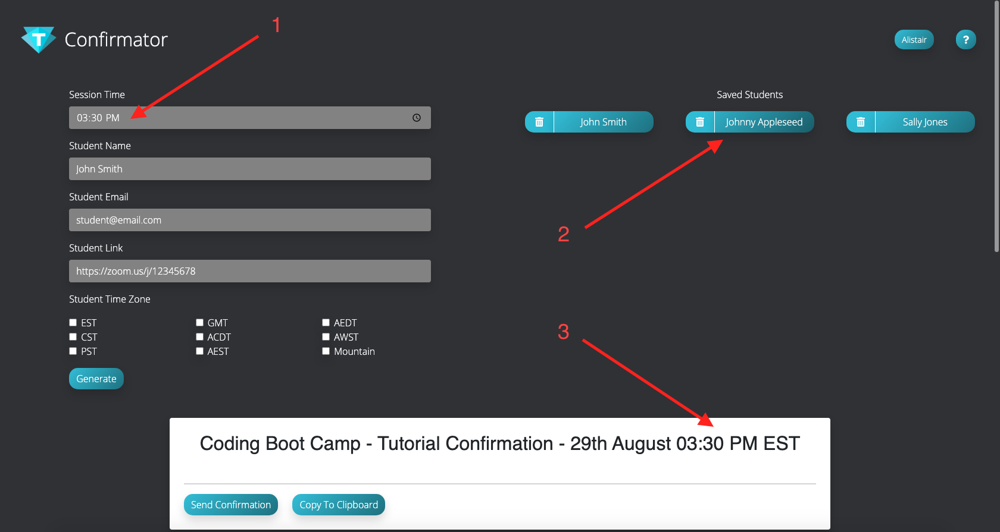

If we want to delete a student we can simply click on the trash icon next to the students name like so.

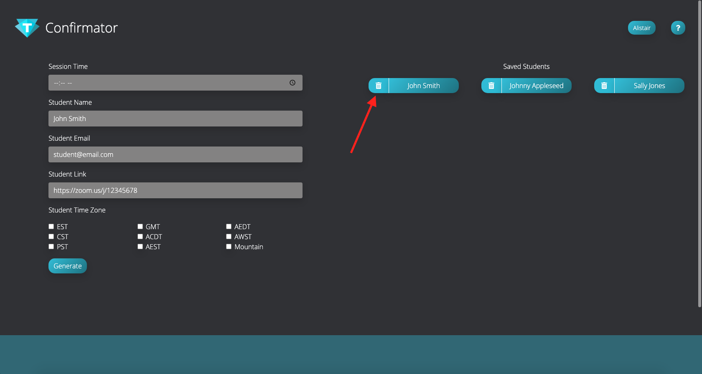

And there you have it, I hope this app helps all the tutors out and makes life a little easier, you all do such great work!

Please feel free to contribute to the project on Github if you have any ideas or improvements, that would be awesome!

Thanks.

Alistair Rowden, Senior Full Stack Tutor

